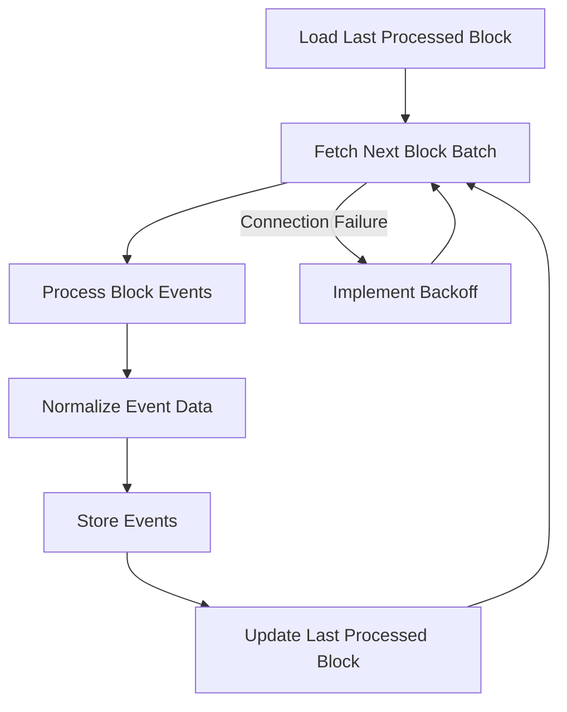
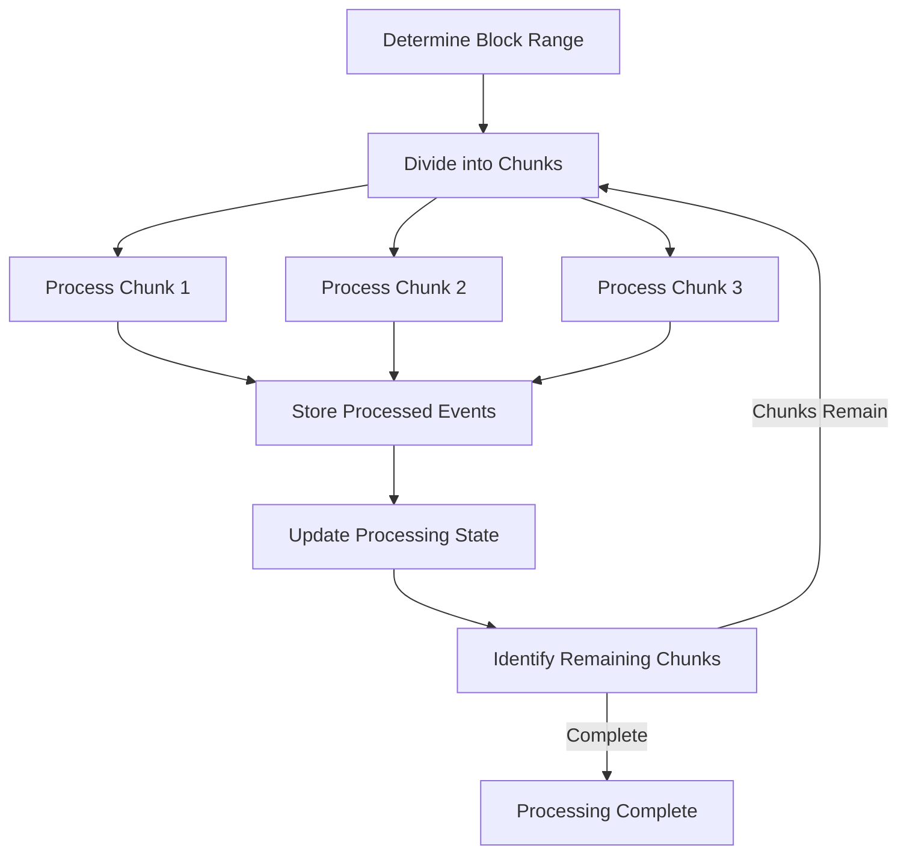
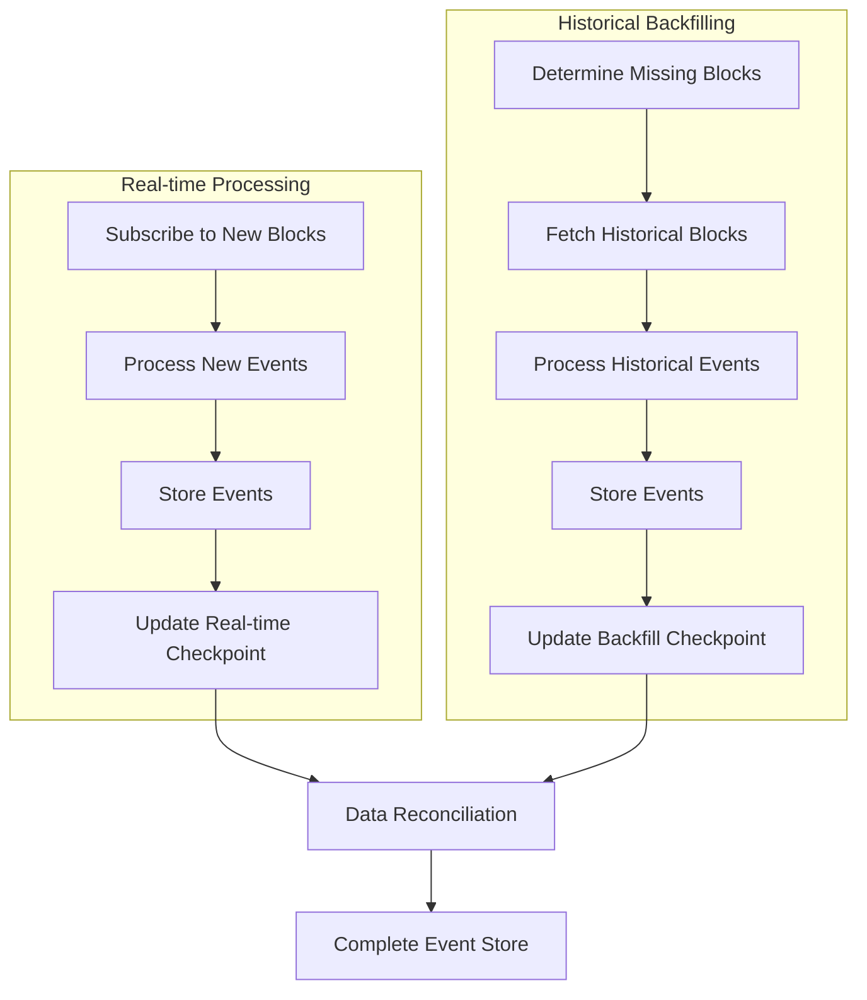

# ⚠️ HISTORICAL DESIGN PROPOSAL ⚠️
> **NOTE**: This document represents a design proposal from the CREATIVE phase and does not reflect the actual implementation. For information about the actual implementation, please refer to the `implementation-reality.md` document in this directory.

# 🎨🎨🎨 ENTERING CREATIVE PHASE: ARCHITECTURE DESIGN

# Resilient Blockchain Event Processing Architecture

## Component Description
The Blockchain Event Processing component is responsible for fetching, processing, and storing liquidity events from Curve and Uniswap V3 pools on the Arbitrum network. It must efficiently handle large volumes of events while being resilient to network issues, providing reliable data for the reward calculation system.

## Requirements & Constraints

### Functional Requirements
1. Fetch liquidity events from multiple Curve and Uniswap V3 pools
2. Process events to extract provider addresses, token amounts, and timestamps
3. Handle different event formats from multiple protocols
4. Track historical liquidity positions over time
5. Support efficient querying for specific time periods
6. Maintain accurate state even during temporary outages

### Technical Constraints
1. Must use Web3.py for blockchain interactions
2. Must handle Arbitrum RPC provider rate limits and failures
3. Must efficiently process and store large volumes of events
4. Must minimize duplicate event processing
5. Must optimize for performance with large datasets
6. Must be resilient to temporary connection issues

## Architecture Options

### Option 1: Sequential Block Processing with State Management

#### Description
This approach processes blocks sequentially, maintains the last processed block, and stores all relevant events. During outages, it can resume from the last successfully processed block.

#### Design Details
- Track the last processed block in a persistent state store
- Process blocks sequentially in batches
- Extract and normalize events from different protocols
- Store processed events with timestamp, provider, and amount information
- Resume from last processed block after failures
- Implement exponential backoff for RPC failures

#### Data Flow


#### Pros
- Simple implementation and intuitive flow
- Guaranteed sequential processing
- Predictable resource usage
- Easy recovery from failures

#### Cons
- Slower processing speed (sequential)
- Higher latency for recent data
- Single point of failure in processing chain
- Less efficient for catching up after long outages

#### Technical Fit: High
#### Complexity: Low
#### Scalability: Medium

### Option 2: Parallel Block Range Processing

#### Description
This approach divides the block range into multiple chunks and processes them in parallel, significantly increasing throughput while implementing conflict resolution for overlapping data.

#### Design Details
- Divide block ranges into non-overlapping chunks
- Process chunks in parallel using asyncio
- Implement work queue for tracking processing status
- Use atomic operations for state updates
- Employ intelligent chunk sizing based on event density
- Implement advanced failure handling per chunk

#### Data Flow


#### Pros
- Much higher throughput and processing speed
- Better resource utilization
- Faster recovery from outages
- More responsive to recent data

#### Cons
- More complex implementation
- Potential for race conditions
- More difficult to debug
- Higher resource consumption

#### Technical Fit: Medium
#### Complexity: High
#### Scalability: High

### Option 3: Event-Subscription Model with Backfilling

#### Description
This hybrid approach uses real-time event subscriptions for recent data while implementing a backfill mechanism for historical data and recovery. It optimizes for both real-time updates and complete historical records.

#### Design Details
- Subscribe to new block events for real-time processing
- Implement background backfilling process for historical data
- Use checkpoint system for tracking both subscription and backfill state
- Employ fingerprinting to prevent duplicate event processing
- Implement priority queue for processing important events first
- Provide reconciliation mechanism to ensure data consistency

#### Data Flow


#### Pros
- Balance of real-time updates and historical completeness
- Efficient use of RPC connections
- More resilient to network disruptions
- Adaptive to different operational needs

#### Cons
- Most complex implementation
- Requires careful coordination between components
- Potential for duplicate event processing
- More challenging to maintain

#### Technical Fit: Medium
#### Complexity: Very High
#### Scalability: Very High

## Recommended Approach

### Selected Option: Parallel Block Range Processing (Option 2)

#### Rationale
The Parallel Block Range Processing approach offers the best balance of performance, resilience, and implementation complexity for this project. While the Event-Subscription Model has advantages for real-time data, the tiered loyalty program primarily needs historical completeness rather than real-time updates. The parallel processing approach significantly improves performance over the sequential model, especially for handling large volumes of historical data, which is critical for this application.

#### Implementation Guidelines

1. **Block Range Management**:
   ```python
   async def process_block_range(start_block, end_block, chunk_size=1000):
       chunks = divide_into_chunks(start_block, end_block, chunk_size)
       tasks = []
       
       for chunk_start, chunk_end in chunks:
           task = asyncio.create_task(process_chunk(chunk_start, chunk_end))
           tasks.append(task)
       
       # Wait for all chunks to complete
       results = await asyncio.gather(*tasks, return_exceptions=True)
       
       # Handle any exceptions
       handle_chunk_exceptions(chunks, results)
       
       return results
   ```

2. **Chunk Processing**:
   ```python
   async def process_chunk(chunk_start, chunk_end):
       events = []
       current_block = chunk_start
       
       while current_block <= chunk_end:
           batch_size = min(100, chunk_end - current_block + 1)
           batch_end = current_block + batch_size - 1
           
           try:
               # Get logs for multiple pools
               batch_events = await fetch_events_batch(current_block, batch_end)
               normalized_events = normalize_events(batch_events)
               events.extend(normalized_events)
               current_block = batch_end + 1
           except Exception as e:
               # Implement retry logic with exponential backoff
               await handle_chunk_error(e, current_block, batch_end)
       
       # Store events for this chunk
       await store_events(events)
       
       # Mark chunk as processed
       await update_chunk_status(chunk_start, chunk_end, "processed")
       
       return events
   ```

3. **Error Handling and Retry Logic**:
   ```python
   async def handle_chunk_error(error, block_start, block_end, max_retries=5):
       for retry in range(max_retries):
           try:
               # Exponential backoff
               wait_time = 2 ** retry
               logger.warning(f"Retrying blocks {block_start}-{block_end} after {wait_time}s. Attempt {retry+1}/{max_retries}")
               await asyncio.sleep(wait_time)
               
               # Try smaller chunk if possible
               if block_end - block_start > 10:
                   mid = (block_start + block_end) // 2
                   await process_chunk(block_start, mid)
                   await process_chunk(mid + 1, block_end)
                   return
               else:
                   # Try with different RPC endpoint
                   await switch_rpc_endpoint()
                   batch_events = await fetch_events_batch(block_start, block_end)
                   await store_events(normalize_events(batch_events))
                   return
           except Exception as e:
               logger.error(f"Retry {retry+1} failed: {str(e)}")
       
       # After all retries failed
       await mark_blocks_for_reprocessing(block_start, block_end)
       logger.error(f"Failed to process blocks {block_start}-{block_end} after {max_retries} attempts")
   ```

4. **RPC Provider Management**:
   ```python
   class ResilientRPCManager:
       def __init__(self, rpc_urls):
           self.rpc_urls = rpc_urls
           self.current_index = 0
           self.web3_instances = [Web3(Web3.HTTPProvider(url)) for url in rpc_urls]
           self.last_switch_time = {}
           self.lock = asyncio.Lock()
       
       async def get_web3(self):
           async with self.lock:
               return self.web3_instances[self.current_index]
       
       async def switch_provider(self):
           async with self.lock:
               # Switch to next provider
               self.current_index = (self.current_index + 1) % len(self.rpc_urls)
               self.last_switch_time[self.current_index] = time.time()
               logger.info(f"Switched to RPC provider {self.current_index}: {self.rpc_urls[self.current_index]}")
               return self.web3_instances[self.current_index]
   ```

5. **Event Normalization**:
   ```python
   def normalize_events(events, protocol_type):
       normalized = []
       
       for event in events:
           if protocol_type == "curve":
               normalized_event = normalize_curve_event(event)
           elif protocol_type == "uniswap_v3":
               normalized_event = normalize_uniswap_event(event)
           else:
               raise ValueError(f"Unknown protocol type: {protocol_type}")
           
           normalized.append(normalized_event)
       
       return normalized
   
   def normalize_curve_event(event):
       # Extract provider, amounts, timestamp from Curve event
       return {
           "provider": event.args.provider,
           "timestamp": get_block_timestamp(event.blockNumber),
           "amounts": [event.args.token_amounts],
           "pool": event.address,
           "type": event.event,
           "block_number": event.blockNumber,
           "protocol": "curve"
       }
   
   def normalize_uniswap_event(event):
       # Extract provider, amounts, timestamp from Uniswap event
       return {
           "provider": event.args.owner,
           "timestamp": get_block_timestamp(event.blockNumber),
           "amounts": [event.args.amount0, event.args.amount1],
           "pool": event.address,
           "type": event.event,
           "block_number": event.blockNumber,
           "protocol": "uniswap_v3"
       }
   ```

#### Data Structures

1. **Processing State**:
   ```json
   {
       "last_processed_block": 12345678,
       "in_progress_chunks": [
           {"start": 12345679, "end": 12346679, "status": "processing"},
           {"start": 12346680, "end": 12347680, "status": "queued"}
       ],
       "completed_chunks": [
           {"start": 12344679, "end": 12345678, "status": "completed", "event_count": 156}
       ],
       "failed_chunks": [
           {"start": 12343679, "end": 12344678, "status": "failed", "retry_count": 5}
       ]
   }
   ```

2. **Normalized Event**:
   ```json
   {
       "provider": "0x1234...5678",
       "timestamp": 1631234567,
       "amounts": [1000000000000000000, 5000000000000000000],
       "pool": "0xabcd...ef01",
       "type": "Deposit",
       "block_number": 12345678,
       "protocol": "uniswap_v3",
       "transaction_hash": "0x2345...6789"
   }
   ```

## Verification

### Requirements Validation
- ✅ Fetches events from multiple protocols
- ✅ Normalizes different event formats
- ✅ Tracks historical liquidity
- ✅ Handles RPC failures gracefully
- ✅ Provides efficient block processing

### Technical Feasibility
The recommended approach is feasible with the current technology stack. The asyncio-based implementation can effectively utilize available resources while handling the complexities of blockchain data fetching.

### Risk Assessment
- **RPC Rate Limiting**: Medium risk - Mitigated by multiple providers and backoff strategy
- **Data Consistency**: Medium risk - Mitigated by chunk retry mechanism
- **Performance**: Low risk - Parallel processing provides good throughput
- **Implementation Complexity**: Medium risk - More complex than sequential but manageable

### Performance Considerations
- Tune chunk size based on event density
- Implement intelligent backoff for RPC providers
- Use connection pooling for Web3 providers
- Consider bloom filters for efficient event filtering
- Implement caching for frequently accessed blocks

# 🎨🎨🎨 EXITING CREATIVE PHASE 