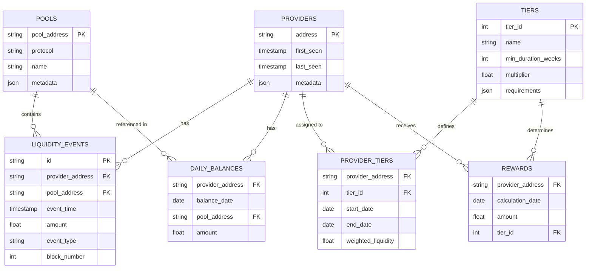
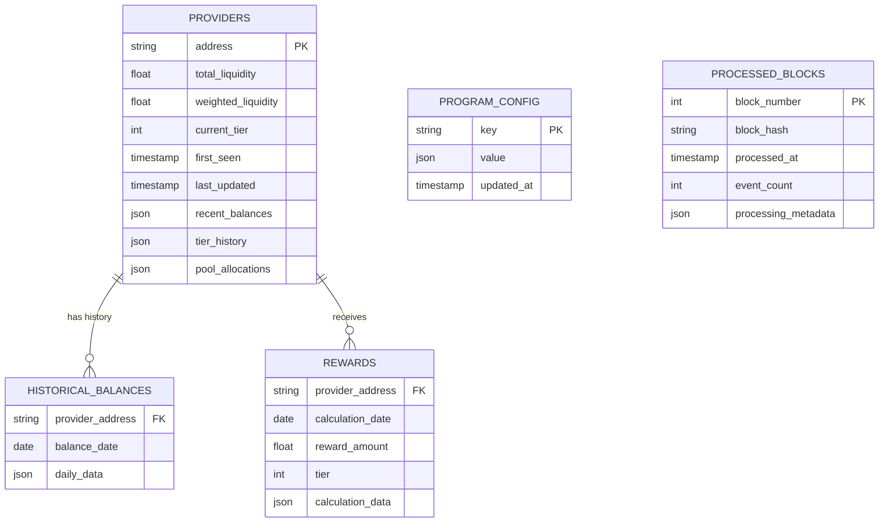
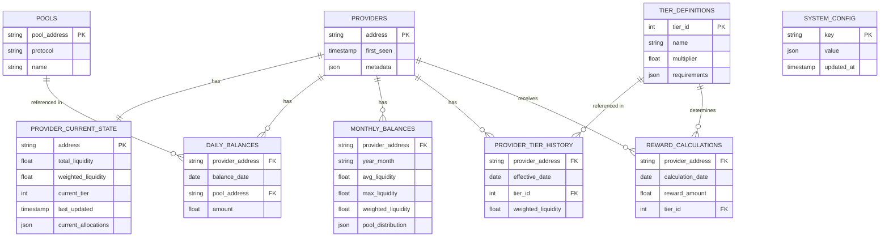

# ⚠️ HISTORICAL DESIGN PROPOSAL ⚠️
> **NOTE**: This document represents a design proposal from the CREATIVE phase and does not reflect the actual implementation. For information about the actual implementation, please refer to the `implementation-reality.md` document in this directory.

# 🎨🎨🎨 ENTERING CREATIVE PHASE: DATA MODEL DESIGN

# Data Model Design for Tiered Loyalty Program

## Component Description
The Data Model design defines the structure and relationships for storing and manipulating liquidity provider data, historical balances, and reward calculations. It must efficiently represent the domain while supporting the performance requirements of the tiered loyalty program.

## Requirements & Constraints

### Functional Requirements
1. Model liquidity provider data across multiple protocols (Curve, Uniswap V3)
2. Track historical liquidity positions with daily granularity
3. Support tier classification based on weighted liquidity
4. Store and query reward calculations
5. Maintain program configuration state
6. Support efficient querying for API endpoints

### Technical Constraints
1. Must integrate with SQLite storage backend
2. Must support efficient time-series queries
3. Must handle potentially large numbers of providers
4. Must optimize for both read and write patterns
5. Must represent complex relationships between entities
6. Must support data validation and integrity

## Data Model Options

### Option 1: Normalized Relational Model

#### Description
This approach uses a fully normalized relational model with separate tables for each entity type and explicit relationships between them.

#### Design Details
- **Providers Table**: Core provider information
- **Pools Table**: Protocol pool information
- **Liquidity_Events Table**: Individual liquidity events
- **Daily_Balances Table**: Aggregated daily balances
- **Tiers Table**: Tier definitions and thresholds
- **Provider_Tiers Table**: Historical tier assignments
- **Rewards Table**: Calculated reward distributions
- Use foreign keys to enforce referential integrity
- Implement database constraints for data validation

#### Entity-Relationship Diagram


#### Pros
- Clear and maintainable structure
- Strong data integrity through constraints
- Flexible querying through joins
- Reduced data redundancy
- Well-suited for complex relationships

#### Cons
- More complex queries requiring joins
- Potentially lower performance for specific access patterns
- More tables to manage
- Higher storage overhead for relationships
- More complex data access logic

#### Technical Fit: Medium
#### Complexity: High
#### Scalability: Medium

### Option 2: Denormalized Document-Oriented Model

#### Description
This approach uses a partially denormalized model with fewer tables and embedded JSON documents for related data, optimizing for access patterns rather than normalization.

#### Design Details
- **Providers Table**: Core provider information with embedded recent data
- **Historical_Balances Table**: Time-series data with simple structure
- **Program_Config Table**: Key-value store for configuration
- **Processed_Blocks Table**: Tracking of blockchain processing
- Store frequently accessed related data together
- Optimize schema for common query patterns
- Use JSON columns for flexible, schemaless data

#### Data Structure Diagram


#### Pros
- Optimized for common access patterns
- Fewer joins needed for typical queries
- Better read performance
- Simpler queries for API endpoints
- More flexible schema evolution

#### Cons
- Potential data redundancy
- Weaker enforcement of data integrity
- More complex update logic
- Risk of data inconsistency
- Less efficient for some analytical queries

#### Technical Fit: High
#### Complexity: Medium
#### Scalability: High

### Option 3: Hybrid Time-Series Optimized Model

#### Description
This approach uses a hybrid model specifically optimized for time-series data, with normalized reference data and denormalized time-series data.

#### Design Details
- **Reference Tables**: Normalized for providers, pools, tiers
- **Time-Series Tables**: Optimized for temporal data
  - Sharded by time periods (monthly/quarterly)
  - Indexed by time ranges
- **Materialized Views**: Precomputed aggregations
- Use table partitioning for time-series data
- Implement efficient range queries
- Store aggregated data at multiple time granularities

#### Data Structure Diagram


#### Pros
- Optimized for time-series performance
- Balance of normalization and denormalization
- Efficient for both operational and analytical queries
- Better scalability for growing time-series data
- Supports multiple time granularities efficiently

#### Cons
- Most complex implementation
- Requires more sophisticated data management
- Higher maintenance overhead
- More complex query patterns
- Requires careful indexing strategy

#### Technical Fit: Medium
#### Complexity: Very High
#### Scalability: Very High

## Recommended Approach

### Selected Option: Denormalized Document-Oriented Model (Option 2)

#### Rationale
The Denormalized Document-Oriented Model offers the best balance of performance, implementation complexity, and alignment with the application's access patterns. While the normalized model provides stronger data integrity guarantees, the performance benefits of denormalization are significant for this application where read operations (particularly for API endpoints) are expected to be more frequent than writes. The hybrid time-series approach, while powerful for very large datasets, introduces complexity that isn't justified by the current scale requirements.

#### Implementation Guidelines

1. **Database Schema**:
   ```sql
   -- Provider information with current state
   CREATE TABLE providers (
       address TEXT PRIMARY KEY,
       total_liquidity REAL NOT NULL DEFAULT 0,
       weighted_liquidity REAL NOT NULL DEFAULT 0,
       current_tier INTEGER NOT NULL DEFAULT 1,
       first_seen_date TIMESTAMP NOT NULL,
       last_updated TIMESTAMP NOT NULL,
       pool_allocations JSON,  -- Current allocations across pools
       tier_history JSON,      -- Historical tier assignments
       recent_activity JSON    -- Recent transactions/events
   );
   
   -- Historical daily balances (one row per provider per day)
   CREATE TABLE historical_balances (
       provider_address TEXT NOT NULL,
       balance_date DATE NOT NULL,
       daily_data JSON NOT NULL,  -- Contains pools, amounts, protocols
       PRIMARY KEY (provider_address, balance_date)
   );
   
   -- Reward calculations
   CREATE TABLE rewards (
       provider_address TEXT NOT NULL,
       calculation_date TIMESTAMP NOT NULL,
       reward_amount REAL NOT NULL,
       tier INTEGER NOT NULL,
       calculation_data JSON,  -- Details of the calculation
       PRIMARY KEY (provider_address, calculation_date)
   );
   
   -- Program configuration
   CREATE TABLE program_config (
       key TEXT PRIMARY KEY,
       value JSON NOT NULL,
       updated_at TIMESTAMP NOT NULL DEFAULT CURRENT_TIMESTAMP
   );
   
   -- Processed blockchain blocks
   CREATE TABLE processed_blocks (
       block_number INTEGER PRIMARY KEY,
       block_hash TEXT NOT NULL,
       processed_at TIMESTAMP NOT NULL,
       event_count INTEGER NOT NULL DEFAULT 0,
       processing_metadata JSON
   );
   
   -- Create indexes for common queries
   CREATE INDEX idx_historical_balances_date ON historical_balances(balance_date);
   CREATE INDEX idx_rewards_date ON rewards(calculation_date);
   CREATE INDEX idx_providers_tier ON providers(current_tier);
   CREATE INDEX idx_providers_weighted ON providers(weighted_liquidity);
   ```

2. **Data Structure Formats**:

   **Provider Record**:
   ```json
   {
     "address": "0x1234567890abcdef1234567890abcdef12345678",
     "total_liquidity": 10000.0,
     "weighted_liquidity": 12000.0,
     "current_tier": 2,
     "first_seen_date": "2024-09-10T12:34:56",
     "last_updated": "2024-10-15T09:23:45",
     "pool_allocations": {
       "0xpool1": {
         "protocol": "curve",
         "amount": 6000.0,
         "percentage": 60
       },
       "0xpool2": {
         "protocol": "uniswap_v3",
         "amount": 4000.0,
         "percentage": 40
       }
     },
     "tier_history": [
       {
         "tier": 1,
         "start_date": "2024-09-10",
         "end_date": "2024-10-05",
         "weighted_liquidity": 5000.0
       },
       {
         "tier": 2,
         "start_date": "2024-10-06",
         "weighted_liquidity": 12000.0
       }
     ],
     "recent_activity": {
       "last_deposit": {
         "timestamp": "2024-10-12T14:22:33",
         "pool": "0xpool1",
         "amount": 1000.0
       },
       "last_withdrawal": {
         "timestamp": "2024-10-01T08:45:12",
         "pool": "0xpool2",
         "amount": 500.0
       }
     }
   }
   ```

   **Historical Balance Record**:
   ```json
   {
     "provider_address": "0x1234567890abcdef1234567890abcdef12345678",
     "balance_date": "2024-10-15",
     "daily_data": {
       "total_liquidity": 10000.0,
       "pools": {
         "0xpool1": {
           "protocol": "curve",
           "amount": 6000.0,
           "tokens": [
             {"symbol": "USDC", "amount": 3000.0},
             {"symbol": "USDT", "amount": 3000.0}
           ]
         },
         "0xpool2": {
           "protocol": "uniswap_v3",
           "amount": 4000.0,
           "tokens": [
             {"symbol": "ETH", "amount": 1.5},
             {"symbol": "USDC", "amount": 4000.0}
           ]
         }
       },
       "tier": 2,
       "tier_multiplier": 1.2,
       "weighted_liquidity": 12000.0
     }
   }
   ```

   **Reward Calculation Record**:
   ```json
   {
     "provider_address": "0x1234567890abcdef1234567890abcdef12345678",
     "calculation_date": "2024-10-15T00:00:00",
     "reward_amount": 120.5,
     "tier": 2,
     "calculation_data": {
       "provider_weighted_liquidity": 12000.0,
       "total_weighted_liquidity": 500000.0,
       "percentage_share": 0.024,
       "base_reward": 100.42,
       "tier_multiplier": 1.2,
       "period_start": "2024-10-08",
       "period_end": "2024-10-14"
     }
   }
   ```

   **Program Configuration**:
   ```json
   {
     "key": "loyalty_program_settings",
     "value": {
       "start_date": "2024-09-09",
       "end_date": "2025-03-10",
       "total_rewards": 50000,
       "distributed_rewards": 5000,
       "tier_definitions": [
         {
           "tier": 1,
           "name": "Bronze",
           "min_duration_weeks": 1,
           "multiplier": 1.0
         },
         {
           "tier": 2,
           "name": "Silver",
           "min_duration_weeks": 5,
           "multiplier": 1.2
         },
         {
           "tier": 3,
           "name": "Gold",
           "min_duration_weeks": 13,
           "multiplier": 1.5
         },
         {
           "tier": 4,
           "name": "Platinum",
           "min_duration_weeks": 21,
           "multiplier": 2.0
         }
       ],
       "active_pools": [
         {
           "address": "0xpool1",
           "protocol": "curve",
           "name": "Curve USDC/USDT Pool"
         },
         {
           "address": "0xpool2",
           "protocol": "uniswap_v3",
           "name": "Uniswap V3 ETH/USDC Pool"
         }
       ]
     },
     "updated_at": "2024-09-09T00:00:00"
   }
   ```

3. **Data Access Patterns**:

   **Getting Provider Status**:
   ```python
   def get_provider_status(address):
       """Get provider status including current state and recent history"""
       # Get provider record
       provider = connection.execute(
           "SELECT * FROM providers WHERE address = ?",
           (address,)
       ).fetchone()
       
       if not provider:
           return None
       
       # Get recent historical balances
       recent_history = connection.execute(
           """
           SELECT * FROM historical_balances 
           WHERE provider_address = ? 
           ORDER BY balance_date DESC LIMIT 30
           """,
           (address,)
       ).fetchall()
       
       # Get recent rewards
       recent_rewards = connection.execute(
           """
           SELECT * FROM rewards 
           WHERE provider_address = ? 
           ORDER BY calculation_date DESC LIMIT 10
           """,
           (address,)
       ).fetchall()
       
       # Combine all data
       return {
           "provider": dict(provider),
           "recent_history": [dict(h) for h in recent_history],
           "recent_rewards": [dict(r) for r in recent_rewards]
       }
   ```

   **Updating Provider Liquidity**:
   ```python
   def update_provider_liquidity(address, new_total_liquidity, pool_allocations):
       """Update provider liquidity and recalculate tier"""
       # Get current provider data
       provider = connection.execute(
           "SELECT * FROM providers WHERE address = ?",
           (address,)
       ).fetchone()
       
       # Calculate duration and tier
       if provider:
           first_seen = provider["first_seen_date"]
           duration_weeks = (datetime.now() - first_seen).days // 7
           tier_history = json.loads(provider["tier_history"] or "[]")
       else:
           first_seen = datetime.now()
           duration_weeks = 0
           tier_history = []
       
       # Determine tier based on duration
       tier, multiplier = determine_tier(duration_weeks)
       
       # Calculate weighted liquidity
       weighted_liquidity = new_total_liquidity * multiplier
       
       # Update tier history if changed
       current_tier = provider["current_tier"] if provider else 0
       if tier != current_tier:
           if tier_history and "end_date" not in tier_history[-1]:
               tier_history[-1]["end_date"] = datetime.now().date().isoformat()
           
           tier_history.append({
               "tier": tier,
               "start_date": datetime.now().date().isoformat(),
               "weighted_liquidity": weighted_liquidity
           })
       
       # Update provider record
       with connection:
           connection.execute(
               """
               INSERT INTO providers 
                   (address, total_liquidity, weighted_liquidity, current_tier, 
                    first_seen_date, last_updated, pool_allocations, tier_history) 
               VALUES (?, ?, ?, ?, ?, ?, ?, ?)
               ON CONFLICT(address) DO UPDATE SET
                   total_liquidity = ?,
                   weighted_liquidity = ?,
                   current_tier = ?,
                   last_updated = ?,
                   pool_allocations = ?,
                   tier_history = ?
               """,
               (
                   address, new_total_liquidity, weighted_liquidity, tier,
                   first_seen, datetime.now(), json.dumps(pool_allocations), json.dumps(tier_history),
                   new_total_liquidity, weighted_liquidity, tier,
                   datetime.now(), json.dumps(pool_allocations), json.dumps(tier_history)
               )
           )
       
       return {
           "address": address,
           "total_liquidity": new_total_liquidity,
           "weighted_liquidity": weighted_liquidity,
           "tier": tier,
           "tier_multiplier": multiplier
       }
   ```

   **Calculating Rewards**:
   ```python
   def calculate_rewards(calculation_date=None):
       """Calculate rewards for all providers"""
       if calculation_date is None:
           calculation_date = datetime.now()
       
       # Get program configuration
       config = connection.execute(
           "SELECT value FROM program_config WHERE key = 'loyalty_program_settings'"
       ).fetchone()
       
       if not config:
           raise ValueError("Program configuration not found")
       
       settings = json.loads(config["value"])
       total_rewards = settings["total_rewards"]
       
       # Get all providers with their weighted liquidity
       providers = connection.execute(
           "SELECT address, weighted_liquidity, current_tier FROM providers"
       ).fetchall()
       
       # Calculate total weighted liquidity
       total_weighted = sum(p["weighted_liquidity"] for p in providers)
       
       # Calculate rewards for each provider
       rewards = []
       for provider in providers:
           if total_weighted == 0:
               reward_amount = 0
           else:
               reward_amount = (provider["weighted_liquidity"] / total_weighted) * total_rewards
           
           calculation_data = {
               "provider_weighted_liquidity": provider["weighted_liquidity"],
               "total_weighted_liquidity": total_weighted,
               "percentage_share": provider["weighted_liquidity"] / total_weighted if total_weighted > 0 else 0,
               "base_reward": reward_amount,
               "tier_multiplier": get_tier_multiplier(provider["current_tier"]),
               "calculation_date": calculation_date.isoformat()
           }
           
           rewards.append({
               "provider_address": provider["address"],
               "calculation_date": calculation_date,
               "reward_amount": reward_amount,
               "tier": provider["current_tier"],
               "calculation_data": calculation_data
           })
       
       # Store rewards in database
       with connection:
           for reward in rewards:
               connection.execute(
                   """
                   INSERT INTO rewards 
                       (provider_address, calculation_date, reward_amount, tier, calculation_data)
                   VALUES (?, ?, ?, ?, ?)
                   """,
                   (
                       reward["provider_address"],
                       reward["calculation_date"],
                       reward["reward_amount"],
                       reward["tier"],
                       json.dumps(reward["calculation_data"])
                   )
               )
       
       return rewards
   ```

4. **Data Validation and Integrity**:
   ```python
   def validate_provider_data(provider_data):
       """Validate provider data structure"""
       required_fields = ["address", "total_liquidity", "pool_allocations"]
       
       # Check required fields
       for field in required_fields:
           if field not in provider_data:
               raise ValueError(f"Missing required field: {field}")
       
       # Validate address format
       if not re.match(r"^0x[a-fA-F0-9]{40}$", provider_data["address"]):
           raise ValueError("Invalid Ethereum address format")
       
       # Validate liquidity values
       if provider_data["total_liquidity"] < 0:
           raise ValueError("Liquidity cannot be negative")
       
       # Validate pool allocations
       if not isinstance(provider_data["pool_allocations"], dict):
           raise ValueError("Pool allocations must be a dictionary")
       
       # Check that pool allocations sum matches total liquidity
       allocation_sum = sum(pool["amount"] for pool in provider_data["pool_allocations"].values())
       if not math.isclose(allocation_sum, provider_data["total_liquidity"], rel_tol=1e-6):
           raise ValueError("Sum of pool allocations does not match total liquidity")
       
       return True
   
   def validate_foreign_keys(provider_address, pool_addresses):
       """Validate references to existing entities"""
       # Check provider exists
       provider = connection.execute(
           "SELECT 1 FROM providers WHERE address = ?",
           (provider_address,)
       ).fetchone()
       
       if not provider:
           raise ValueError(f"Provider {provider_address} does not exist")
       
       # Check pools exist in program configuration
       config = json.loads(connection.execute(
           "SELECT value FROM program_config WHERE key = 'loyalty_program_settings'"
       ).fetchone()["value"])
       
       active_pools = {pool["address"] for pool in config["active_pools"]}
       
       for pool_address in pool_addresses:
           if pool_address not in active_pools:
               raise ValueError(f"Pool {pool_address} is not an active pool in the program")
       
       return True
   ```

5. **Query Optimization**:
   ```python
   def get_top_providers(limit=10):
       """Get top providers by weighted liquidity"""
       return connection.execute(
           """
           SELECT address, total_liquidity, weighted_liquidity, current_tier
           FROM providers
           ORDER BY weighted_liquidity DESC
           LIMIT ?
           """,
           (limit,)
       ).fetchall()
   
   def get_tier_distribution():
       """Get distribution of providers across tiers"""
       return connection.execute(
           """
           SELECT current_tier, COUNT(*) as provider_count
           FROM providers
           GROUP BY current_tier
           ORDER BY current_tier
           """
       ).fetchall()
   
   def get_historical_trend(days=30):
       """Get historical trend of total liquidity"""
       cutoff_date = (datetime.now() - timedelta(days=days)).date()
       
       return connection.execute(
           """
           SELECT balance_date, 
                  SUM(json_extract(daily_data, '$.total_liquidity')) as total_liquidity,
                  COUNT(DISTINCT provider_address) as provider_count
           FROM historical_balances
           WHERE balance_date >= ?
           GROUP BY balance_date
           ORDER BY balance_date
           """,
           (cutoff_date.isoformat(),)
       ).fetchall()
   ```

## Verification

### Requirements Validation
- ✅ Models liquidity provider data across protocols
- ✅ Tracks historical liquidity positions
- ✅ Supports tier classification
- ✅ Stores and queries reward calculations
- ✅ Maintains program configuration
- ✅ Supports efficient API queries

### Technical Feasibility
The recommended approach is highly feasible with the SQLite backend and Python application. The denormalized model with JSON columns provides a good balance of structure and flexibility.

### Risk Assessment
- **Data Integrity**: Medium risk - Mitigated with application-level validation
- **Performance**: Low risk - Denormalized structure optimized for common queries
- **Schema Evolution**: Low risk - JSON fields allow for flexible additions
- **Query Complexity**: Low risk - Simple queries for common operations

### Performance Considerations
- Use appropriate indexes for common query patterns
- Consider caching frequently accessed data
- Implement efficient JSON parsing and generation
- Monitor query performance as data grows
- Optimize bulk operations for historical data

# 🎨🎨🎨 EXITING CREATIVE PHASE 