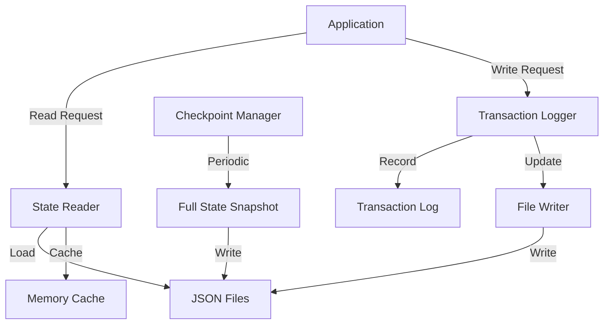
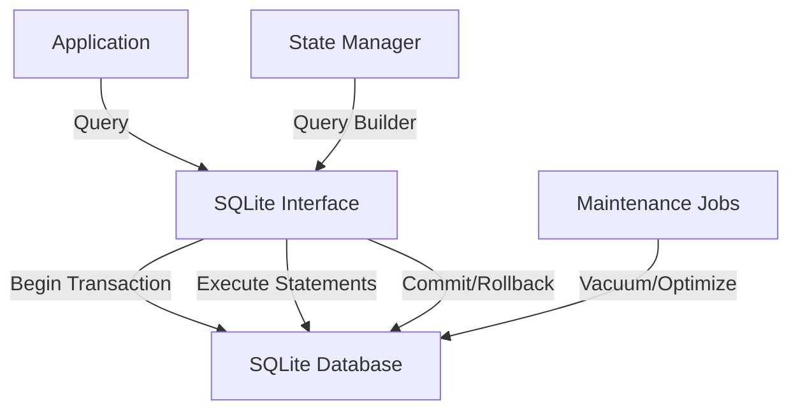
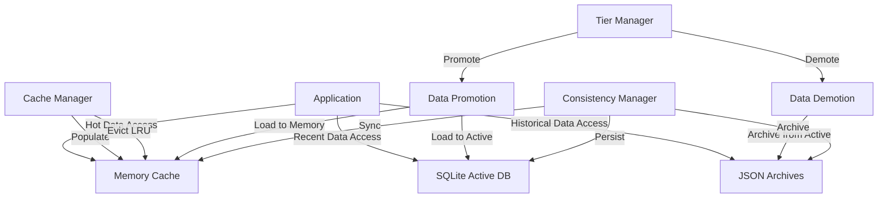

# ⚠️ HISTORICAL DESIGN PROPOSAL ⚠️
> **NOTE**: This document represents a design proposal from the CREATIVE phase and does not reflect the actual implementation. For information about the actual implementation, please refer to the `implementation-reality.md` document in this directory.

# 🎨🎨🎨 ENTERING CREATIVE PHASE: ARCHITECTURE DESIGN

# Efficient State Management System Architecture

## Component Description
The State Management System is responsible for persisting, retrieving, and maintaining the application state, including processed events, provider balances, program configuration, and calculation results. It must provide efficient access patterns while ensuring data consistency even during failures.

## Requirements & Constraints

### Functional Requirements
1. Store and retrieve application state data reliably
2. Maintain historical records of liquidity positions
3. Track program state including last processed block
4. Support atomic updates to prevent data corruption
5. Enable efficient querying of state for reward calculations
6. Facilitate recovery in case of application failures

### Technical Constraints
1. Must use local file system for persistent storage
2. Must handle large volumes of time-series data
3. Must ensure data consistency during concurrent operations
4. Must optimize for both read and write performance
5. Must support version control of state data
6. Must be resilient to unexpected application termination

## Architecture Options

### Option 1: JSON File-Based State Management

#### Description
This approach uses a collection of JSON files to store different aspects of application state, with a periodic checkpoint system and transaction log to ensure consistency.

#### Design Details
- Separate JSON files for different state components:
  - `program_state.json`: Basic program configuration
  - `provider_balances.json`: Current provider balances
  - `historical_balances/`: Directory with date-based JSON files
  - `transaction_log.json`: Log of state-changing operations
- Implement write-ahead logging for crash recovery
- Use atomic file replacements for consistency (write to temp, then rename)
- Periodic full state checkpoints
- Maintain in-memory cache of frequently accessed data

#### Data Flow


#### Pros
- Simple implementation with standard libraries
- Human-readable data format
- Easy debugging and manual inspection
- No external dependencies
- Direct file system access

#### Cons
- Limited performance for large datasets
- Potential for file corruption during crashes
- Challenge in maintaining consistency across files
- Less efficient for complex queries
- Limited concurrency support

#### Technical Fit: High
#### Complexity: Low
#### Scalability: Low

### Option 2: SQLite-Based State Management

#### Description
This approach uses SQLite as an embedded database for state management, leveraging its ACID properties and SQL query capabilities while maintaining file-based storage.

#### Design Details
- Single SQLite database file with multiple tables:
  - `program_config`: Program settings and global state
  - `processed_blocks`: Tracking of processed blockchain data
  - `provider_balances`: Current liquidity positions
  - `daily_balances`: Historical daily balance snapshots
  - `rewards`: Calculated rewards by provider
- Use SQLite transactions for atomicity
- Implement indexing strategies for query performance
- Periodic database vacuuming for optimization
- Connection pooling for concurrent operations

#### Data Flow


#### Pros
- ACID transactions ensure data consistency
- Powerful query capabilities with SQL
- Better performance for complex data relationships
- Built-in concurrency handling
- Mature and well-tested technology

#### Cons
- Slightly more complex implementation than plain files
- Potential lock contention with many concurrent writes
- More complex backup procedures
- Requires careful index management for performance
- Minor external dependency (though SQLite is embedded)

#### Technical Fit: High
#### Complexity: Medium
#### Scalability: Medium

### Option 3: Hybrid Tiered Storage System

#### Description
This approach uses a multi-tiered storage strategy with in-memory caching, local SQLite for recent/active data, and archived JSON files for historical data, optimizing for different access patterns.

#### Design Details
- Three-tiered storage architecture:
  - **Memory Layer**: In-memory cache for active data with LRU eviction
  - **Active Storage**: SQLite database for recent and frequently accessed data
  - **Archive Storage**: JSON files organized by time periods for historical data
- Background processes for data migration between tiers
- Smart prefetching based on access patterns
- Periodic synchronization between layers
- Transaction-based consistency across tiers

#### Data Flow


#### Pros
- Optimized for different data access patterns
- Best performance for both recent and historical data
- More efficient resource utilization
- Flexible scaling for different data volumes
- Better handling of time-series data

#### Cons
- Most complex implementation
- More challenging to ensure consistency across tiers
- Higher maintenance overhead
- More difficult to debug
- Requires careful tuning of tier thresholds

#### Technical Fit: Medium
#### Complexity: High
#### Scalability: High

## Recommended Approach

### Selected Option: SQLite-Based State Management (Option 2)

#### Rationale
The SQLite-Based State Management offers the best balance of performance, reliability, and implementation complexity for this project. While the JSON file approach is simpler, it lacks the robust transaction support and query capabilities needed for complex state management. The Hybrid Tiered approach, though powerful, introduces complexity that isn't justified by the scale of this application. SQLite provides ACID guarantees, efficient querying, and good performance characteristics while still being file-based and easy to integrate.

#### Implementation Guidelines

1. **Database Schema**:
   ```sql
   -- Program configuration and global state
   CREATE TABLE program_config (
       key TEXT PRIMARY KEY,
       value JSON NOT NULL,
       updated_at TIMESTAMP NOT NULL DEFAULT CURRENT_TIMESTAMP
   );
   
   -- Track processed blockchain blocks
   CREATE TABLE processed_blocks (
       block_number INTEGER PRIMARY KEY,
       block_hash TEXT NOT NULL,
       processed_at TIMESTAMP NOT NULL,
       event_count INTEGER NOT NULL DEFAULT 0
   );
   
   -- Current provider balances
   CREATE TABLE provider_balances (
       provider_address TEXT PRIMARY KEY,
       total_liquidity REAL NOT NULL DEFAULT 0,
       weighted_liquidity REAL NOT NULL DEFAULT 0,
       current_tier INTEGER NOT NULL DEFAULT 1,
       first_seen_date TIMESTAMP NOT NULL,
       last_updated TIMESTAMP NOT NULL,
       metadata JSON
   );
   
   -- Historical daily balances
   CREATE TABLE daily_balances (
       provider_address TEXT NOT NULL,
       date DATE NOT NULL,
       liquidity_amount REAL NOT NULL,
       protocol TEXT NOT NULL,
       pool_address TEXT NOT NULL,
       PRIMARY KEY (provider_address, date, pool_address)
   );
   
   -- Reward calculations
   CREATE TABLE rewards (
       provider_address TEXT NOT NULL,
       calculation_date TIMESTAMP NOT NULL,
       reward_amount REAL NOT NULL,
       tier INTEGER NOT NULL,
       PRIMARY KEY (provider_address, calculation_date)
   );
   
   -- Create necessary indexes
   CREATE INDEX idx_daily_balances_date ON daily_balances(date);
   CREATE INDEX idx_daily_balances_provider ON daily_balances(provider_address);
   CREATE INDEX idx_rewards_date ON rewards(calculation_date);
   ```

2. **State Manager Implementation**:
   ```python
   class SQLiteStateManager:
       def __init__(self, db_path, in_memory_cache=True):
           self.db_path = db_path
           self.connection = self._create_connection()
           self.cache = {} if in_memory_cache else None
           self._initialize_schema()
       
       def _create_connection(self):
           """Create SQLite connection with appropriate configuration"""
           conn = sqlite3.connect(
               self.db_path,
               detect_types=sqlite3.PARSE_DECLTYPES | sqlite3.PARSE_COLNAMES,
               isolation_level=None  # Enable autocommit mode
           )
           conn.execute("PRAGMA journal_mode=WAL")  # Use Write-Ahead Logging
           conn.execute("PRAGMA synchronous=NORMAL")  # Balance durability and performance
           conn.row_factory = sqlite3.Row  # Return rows as dict-like objects
           return conn
       
       def _initialize_schema(self):
           """Initialize database schema if not exists"""
           with open('schema.sql', 'r') as f:
               self.connection.executescript(f.read())
       
       def begin_transaction(self):
           """Begin a transaction for a series of operations"""
           self.connection.execute("BEGIN TRANSACTION")
       
       def commit(self):
           """Commit the current transaction"""
           self.connection.execute("COMMIT")
       
       def rollback(self):
           """Rollback the current transaction"""
           self.connection.execute("ROLLBACK")
       
       def update_program_config(self, key, value):
           """Update program configuration value"""
           self.connection.execute(
               "INSERT OR REPLACE INTO program_config (key, value, updated_at) VALUES (?, ?, ?)",
               (key, json.dumps(value), datetime.now())
           )
       
       def get_program_config(self, key, default=None):
           """Get program configuration value"""
           # Check cache first
           if self.cache and key in self.cache:
               return self.cache[key]
           
           row = self.connection.execute(
               "SELECT value FROM program_config WHERE key = ?",
               (key,)
           ).fetchone()
           
           if row:
               value = json.loads(row['value'])
               # Update cache
               if self.cache is not None:
                   self.cache[key] = value
               return value
           
           return default
       
       def update_provider_balance(self, provider_address, total_liquidity, weighted_liquidity, tier):
           """Update provider balance information"""
           now = datetime.now()
           self.connection.execute(
               """
               INSERT INTO provider_balances 
                   (provider_address, total_liquidity, weighted_liquidity, current_tier, last_updated) 
               VALUES (?, ?, ?, ?, ?)
               ON CONFLICT(provider_address) DO UPDATE SET
                   total_liquidity = ?,
                   weighted_liquidity = ?,
                   current_tier = ?,
                   last_updated = ?
               """,
               (
                   provider_address, total_liquidity, weighted_liquidity, tier, now,
                   total_liquidity, weighted_liquidity, tier, now
               )
           )
       
       def get_provider_balance(self, provider_address):
           """Get provider balance information"""
           row = self.connection.execute(
               "SELECT * FROM provider_balances WHERE provider_address = ?",
               (provider_address,)
           ).fetchone()
           
           return dict(row) if row else None
       
       def record_daily_balance(self, provider_address, date, amount, protocol, pool_address):
           """Record daily balance for a provider"""
           self.connection.execute(
               """
               INSERT INTO daily_balances 
                   (provider_address, date, liquidity_amount, protocol, pool_address)
               VALUES (?, ?, ?, ?, ?)
               ON CONFLICT(provider_address, date, pool_address) DO UPDATE SET
                   liquidity_amount = ?
               """,
               (provider_address, date, amount, protocol, pool_address, amount)
           )
       
       def get_daily_balances(self, provider_address=None, start_date=None, end_date=None):
           """Get daily balances with optional filters"""
           query = "SELECT * FROM daily_balances WHERE 1=1"
           params = []
           
           if provider_address:
               query += " AND provider_address = ?"
               params.append(provider_address)
           
           if start_date:
               query += " AND date >= ?"
               params.append(start_date)
           
           if end_date:
               query += " AND date <= ?"
               params.append(end_date)
           
           query += " ORDER BY date"
           
           return [dict(row) for row in self.connection.execute(query, params).fetchall()]
       
       def backup_database(self, backup_path):
           """Create a backup of the database"""
           backup_conn = sqlite3.connect(backup_path)
           self.connection.backup(backup_conn)
           backup_conn.close()
       
       def optimize_database(self):
           """Optimize database by analyzing and vacuuming"""
           self.connection.execute("ANALYZE")
           self.connection.execute("VACUUM")
       
       def close(self):
           """Close the database connection"""
           if self.connection:
               self.connection.close()
   ```

3. **Transaction Context Manager**:
   ```python
   class StateTransaction:
       def __init__(self, state_manager):
           self.state_manager = state_manager
       
       def __enter__(self):
           self.state_manager.begin_transaction()
           return self.state_manager
       
       def __exit__(self, exc_type, exc_val, exc_tb):
           if exc_type is None:
               # No exception occurred, commit transaction
               self.state_manager.commit()
           else:
               # Exception occurred, rollback transaction
               self.state_manager.rollback()
               return False  # Re-raise the exception
   ```

4. **State Manager Usage Example**:
   ```python
   # Initialize state manager
   state_manager = SQLiteStateManager("program_state.db")
   
   # Update program configuration
   state_manager.update_program_config("last_processed_block", 12345678)
   
   # Read configuration
   last_block = state_manager.get_program_config("last_processed_block")
   
   # Use transaction for atomic operations
   try:
       with StateTransaction(state_manager) as txn:
           txn.update_provider_balance("0x1234...", 1000.0, 1200.0, 2)
           txn.record_daily_balance("0x1234...", date.today(), 1000.0, "uniswap_v3", "0xabcd...")
   except Exception as e:
       logger.error(f"Transaction failed: {str(e)}")
   
   # Query data
   balances = state_manager.get_daily_balances(
       provider_address="0x1234...",
       start_date=date.today() - timedelta(days=30),
       end_date=date.today()
   )
   
   # Periodic maintenance
   def scheduled_maintenance():
       state_manager.backup_database(f"backups/state_{datetime.now().strftime('%Y%m%d%H%M%S')}.db")
       state_manager.optimize_database()
   ```

5. **Backup and Recovery Strategy**:
   ```python
   def create_scheduled_backup():
       """Create scheduled database backup"""
       timestamp = datetime.now().strftime("%Y%m%d%H%M%S")
       backup_path = f"backups/state_{timestamp}.db"
       
       # Create backup directory if it doesn't exist
       os.makedirs("backups", exist_ok=True)
       
       # Backup the database
       state_manager.backup_database(backup_path)
       
       # Keep only the last 10 backups
       backups = sorted(glob.glob("backups/state_*.db"))
       if len(backups) > 10:
           for old_backup in backups[:-10]:
               os.remove(old_backup)
   
   def recover_from_backup(backup_path=None):
       """Recover database from backup"""
       if backup_path is None:
           # Find the most recent backup
           backups = sorted(glob.glob("backups/state_*.db"))
           if not backups:
               logger.error("No backup found for recovery")
               return False
           backup_path = backups[-1]
       
       # Close existing connection
       state_manager.close()
       
       # Backup the current database before recovery
       if os.path.exists("program_state.db"):
           os.rename("program_state.db", f"program_state_corrupt_{datetime.now().strftime('%Y%m%d%H%M%S')}.db")
       
       # Restore from backup
       shutil.copy(backup_path, "program_state.db")
       
       # Reconnect to the database
       global state_manager
       state_manager = SQLiteStateManager("program_state.db")
       
       return True
   ```

#### Data Access Patterns

1. **Reading Current Provider Status**:
   ```python
   def get_provider_status(provider_address):
       """Get comprehensive provider status"""
       with StateTransaction(state_manager) as txn:
           # Get basic balance information
           balance_info = txn.get_provider_balance(provider_address)
           if not balance_info:
               return None
           
           # Get recent daily balances
           today = date.today()
           thirty_days_ago = today - timedelta(days=30)
           daily_history = txn.get_daily_balances(
               provider_address=provider_address,
               start_date=thirty_days_ago,
               end_date=today
           )
           
           # Get recent rewards
           rewards = txn.connection.execute(
               "SELECT * FROM rewards WHERE provider_address = ? ORDER BY calculation_date DESC LIMIT 10",
               (provider_address,)
           ).fetchall()
           
           # Combine information
           return {
               "address": provider_address,
               "balance": balance_info,
               "daily_history": daily_history,
               "recent_rewards": [dict(r) for r in rewards]
           }
   ```

2. **Updating Daily Balances in Batch**:
   ```python
   def update_daily_balances_batch(daily_data):
       """Update daily balances in batch"""
       with StateTransaction(state_manager) as txn:
           for record in daily_data:
               txn.record_daily_balance(
                   provider_address=record["provider_address"],
                   date=record["date"],
                   amount=record["amount"],
                   protocol=record["protocol"],
                   pool_address=record["pool_address"]
               )
   ```

3. **Calculating Program Statistics**:
   ```python
   def calculate_program_statistics():
       """Calculate program-wide statistics"""
       with state_manager.connection as conn:
           # Get total providers
           total_providers = conn.execute(
               "SELECT COUNT(*) as count FROM provider_balances"
           ).fetchone()["count"]
           
           # Get tier distribution
           tier_distribution = {}
           for tier in range(1, 5):
               count = conn.execute(
                   "SELECT COUNT(*) as count FROM provider_balances WHERE current_tier = ?",
                   (tier,)
               ).fetchone()["count"]
               tier_distribution[f"tier_{tier}"] = count
           
           # Get total liquidity
           total_liquidity = conn.execute(
               "SELECT SUM(total_liquidity) as sum FROM provider_balances"
           ).fetchone()["sum"] or 0
           
           # Get total weighted liquidity
           total_weighted = conn.execute(
               "SELECT SUM(weighted_liquidity) as sum FROM provider_balances"
           ).fetchone()["sum"] or 0
           
           return {
               "total_providers": total_providers,
               "tier_distribution": tier_distribution,
               "total_liquidity": total_liquidity,
               "total_weighted_liquidity": total_weighted,
               "calculated_at": datetime.now().isoformat()
           }
   ```

## Verification

### Requirements Validation
- ✅ Reliably stores and retrieves application state
- ✅ Maintains historical records of liquidity positions
- ✅ Tracks program state effectively
- ✅ Supports atomic updates with transactions
- ✅ Enables efficient querying with SQL and indexes
- ✅ Facilitates recovery with backup/restore

### Technical Feasibility
The recommended approach is highly feasible with the current technology stack. SQLite is a proven technology that can be easily integrated into the Python application without requiring external services.

### Risk Assessment
- **Data Corruption**: Low risk - SQLite's WAL mode and transactions mitigate this
- **Performance**: Low risk - SQLite performs well for expected data volumes
- **Implementation Complexity**: Low risk - SQLite has a straightforward API
- **Concurrency**: Medium risk - Mitigated with proper transaction handling

### Performance Considerations
- Use WAL journal mode for better write concurrency
- Create appropriate indexes for common query patterns
- Implement scheduled maintenance for optimization
- Consider memory-mapped I/O for performance
- Implement connection pooling for concurrent access

# 🎨🎨🎨 EXITING CREATIVE PHASE