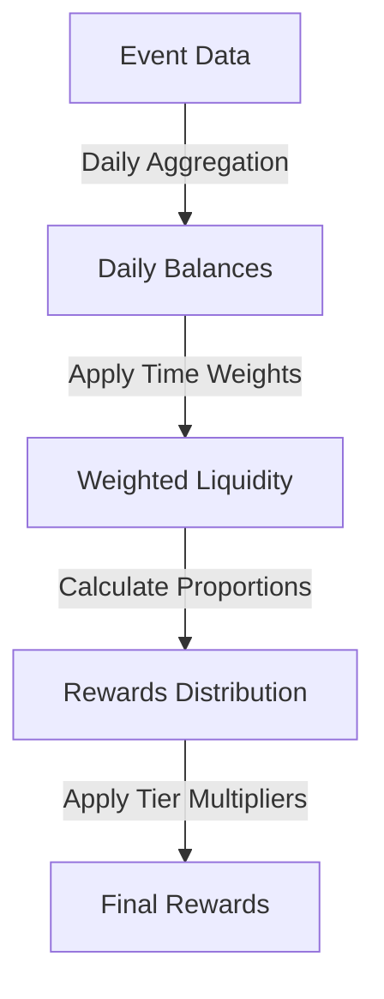
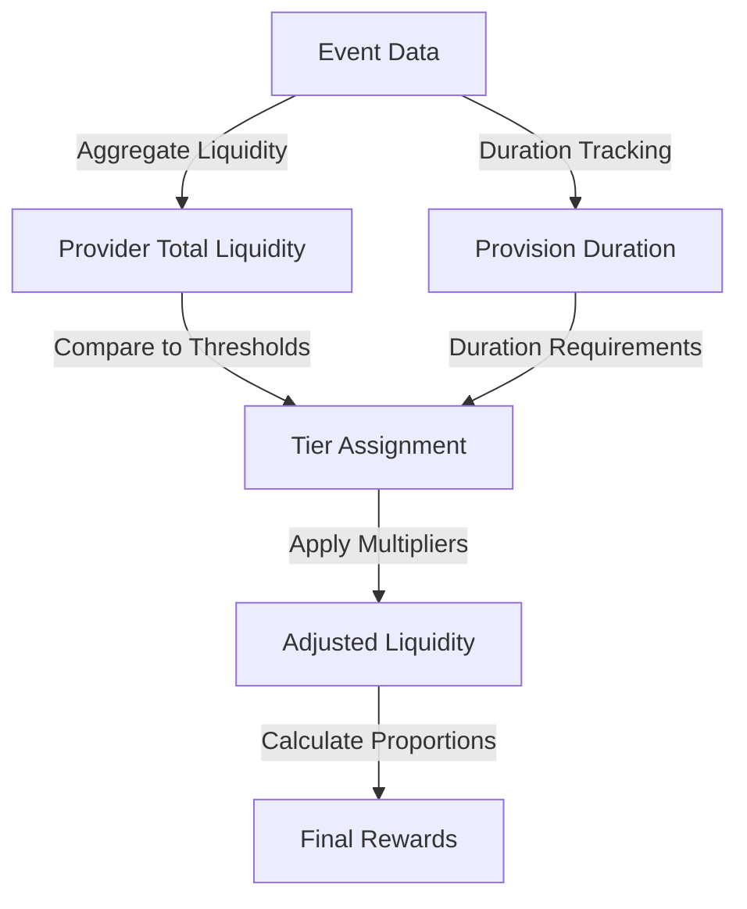
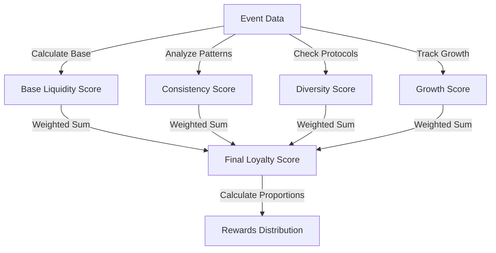

# ⚠️ HISTORICAL DESIGN PROPOSAL ⚠️
> **NOTE**: This document represents a design proposal from the CREATIVE phase and does not reflect the actual implementation. For information about the actual implementation, please refer to the `implementation-reality.md` document in this directory.

# 🎨🎨🎨 ENTERING CREATIVE PHASE: ARCHITECTURE DESIGN

# Tiered Loyalty Algorithm Architecture

## Component Description
The Tiered Loyalty Algorithm is the core calculation component responsible for determining rewards distribution based on liquidity provision. It calculates weighted average liquidity across different protocols (Curve and Uniswap V3) and assigns rewards according to a tiered structure that incentivizes longer-term liquidity provision.

## Requirements & Constraints

### Functional Requirements
1. Calculate weighted average liquidity for each provider across multiple protocols
2. Support tiered reward distribution based on liquidity amount and duration
3. Adjust rewards based on tier qualification
4. Track provider progress through tiers over time
5. Support for 30-week program duration
6. Distribute total rewards (50,000 units) proportionally among providers

### Technical Constraints
1. Must efficiently process large volumes of blockchain events
2. Must handle historical data accumulation over the 30-week period
3. Must be resilient to temporary data availability issues
4. Must use Python with the existing technology stack
5. Must be optimized for calculation performance with large datasets

## Architecture Options

### Option 1: Time-Weighted Average Liquidity Model

#### Description
This approach calculates rewards based on the time-weighted average liquidity (TWAL) for each provider. Liquidity is weighted by the duration it has been provided, with longer durations receiving higher weights.

#### Design Details
- Calculate daily snapshots of liquidity positions
- Apply time-weighting factors based on provision duration:
  - Tier 1 (1-4 weeks): 1.0x multiplier
  - Tier 2 (5-12 weeks): 1.2x multiplier
  - Tier 3 (13-20 weeks): 1.5x multiplier
  - Tier 4 (21-30 weeks): 2.0x multiplier
- Reward formula: `provider_reward = (provider_weighted_liquidity / total_weighted_liquidity) * total_rewards`

#### Data Flow


#### Pros
- Simple conceptual model that is easy to explain to users
- Directly incentivizes long-term liquidity provision
- Smooth progression through tiers
- Lower computational complexity for large datasets

#### Cons
- May not adequately reward significant short-term liquidity
- Requires continuous tracking of liquidity durations
- Less responsive to rapid changes in liquidity

#### Technical Fit: High
#### Complexity: Medium
#### Scalability: High

### Option 2: Tiered Threshold Model

#### Description
This approach establishes fixed liquidity thresholds for each tier, with higher tiers receiving larger reward multipliers. Providers qualify for tiers based on both amount and duration of liquidity.

#### Design Details
- Define tier thresholds:
  - Tier 1: >1,000 units for >1 week
  - Tier 2: >5,000 units for >4 weeks
  - Tier 3: >10,000 units for >12 weeks
  - Tier 4: >20,000 units for >20 weeks
- Apply reward multipliers by tier:
  - Tier 1: 1.0x
  - Tier 2: 1.3x
  - Tier 3: 1.7x
  - Tier 4: 2.5x
- Reward formula: `provider_reward = (provider_liquidity * tier_multiplier / sum(all_provider_adjusted_liquidity)) * total_rewards`

#### Data Flow


#### Pros
- Clear qualification criteria that users can understand and target
- Significant rewards for reaching higher tiers
- Flexible threshold configuration for program adjustments
- Directly supports marketing around tier achievements

#### Cons
- Step-function transitions between tiers may create discontinuities
- More complex to implement correctly
- May encourage gaming behavior around threshold boundaries
- Higher computational requirements for tier determination

#### Technical Fit: Medium
#### Complexity: High
#### Scalability: Medium

### Option 3: Hybrid Score-Based Model

#### Description
This approach calculates a loyalty score for each provider based on multiple factors including liquidity amount, duration, consistency, and protocol diversity. Rewards are distributed proportional to these scores.

#### Design Details
- Calculate base score from liquidity amount and duration
- Apply multipliers for:
  - Consistency (reduced fluctuations): 0.1-0.3x bonus
  - Protocol diversity (providing across multiple pools): 0.1-0.2x bonus
  - Growth over time (increasing positions): 0.1-0.3x bonus
- Define score ranges for tiers rather than strict thresholds
- Reward formula: `provider_reward = (provider_score / sum(all_provider_scores)) * total_rewards`

#### Data Flow


#### Pros
- Highly flexible and can optimize for various program goals
- Rewards multiple dimensions of "good" liquidity provider behavior
- Can be tuned over time without changing the core algorithm
- More difficult for users to game the system

#### Cons
- More complex to explain to users
- Higher computational complexity
- Requires more extensive data collection and analysis
- More parameters to tune and optimize

#### Technical Fit: Medium
#### Complexity: Very High
#### Scalability: Medium

## Recommended Approach

### Selected Option: Time-Weighted Average Liquidity Model (Option 1)

#### Rationale
The Time-Weighted Average Liquidity Model offers the best balance of conceptual simplicity, implementation complexity, and alignment with program goals. While the other options provide more flexibility, they introduce additional complexity that may not be justified by the benefits. This approach directly rewards long-term liquidity provision while maintaining computational efficiency.

#### Implementation Guidelines

1. **Daily Balance Calculation**:
   ```python
   def calculate_daily_balances(events, date_range):
       daily_balances = {}
       for date in date_range:
           daily_balances[date] = {}
           for provider in providers:
               daily_balances[date][provider] = sum_liquidity_at_date(provider, date, events)
       return daily_balances
   ```

2. **Tier Assignment**:
   ```python
   def assign_tier(provider, duration_weeks):
       if duration_weeks >= 21:
           return 4, 2.0  # Tier 4: 2.0x multiplier
       elif duration_weeks >= 13:
           return 3, 1.5  # Tier 3: 1.5x multiplier
       elif duration_weeks >= 5:
           return 2, 1.2  # Tier 2: 1.2x multiplier
       else:
           return 1, 1.0  # Tier 1: 1.0x multiplier
   ```

3. **Weighted Liquidity Calculation**:
   ```python
   def calculate_weighted_liquidity(daily_balances, providers):
       weighted_liquidity = {}
       for provider in providers:
           provider_duration = calculate_provider_duration(provider, daily_balances)
           tier, multiplier = assign_tier(provider, provider_duration)
           
           # Average liquidity across the period
           avg_liquidity = calculate_average_liquidity(provider, daily_balances)
           
           # Apply tier multiplier
           weighted_liquidity[provider] = avg_liquidity * multiplier
       return weighted_liquidity
   ```

4. **Rewards Distribution**:
   ```python
   def calculate_rewards(weighted_liquidity, total_rewards):
       total_weighted = sum(weighted_liquidity.values())
       rewards = {}
       
       for provider, weighted in weighted_liquidity.items():
           rewards[provider] = (weighted / total_weighted) * total_rewards
           
       return rewards
   ```

5. **Tier Progression Tracking**:
   ```python
   def track_tier_progression(provider, historical_data, current_date):
       # Get provider's historical tier assignments
       tier_history = []
       for date, data in historical_data.items():
           if date <= current_date:
               duration = calculate_duration_until(provider, date, historical_data)
               tier, _ = assign_tier(provider, duration)
               tier_history.append((date, tier))
       
       return tier_history
   ```

#### Data Structures

1. **Provider Liquidity**:
   ```json
   {
       "provider_address": {
           "daily_balances": {
               "2024-09-10": 1000.0,
               "2024-09-11": 1200.0,
               ...
           },
           "current_tier": 2,
           "tier_history": [
               {"date": "2024-09-10", "tier": 1},
               {"date": "2024-10-15", "tier": 2},
               ...
           ],
           "weighted_liquidity": 1440.0,
           "reward": 150.0
       },
       ...
   }
   ```

2. **Program State**:
   ```json
   {
       "total_weighted_liquidity": 50000.0,
       "total_rewards": 50000,
       "distributed_rewards": 5000,
       "remaining_rewards": 45000,
       "active_providers": 150,
       "current_date": "2024-10-15",
       "program_start_date": "2024-09-09",
       "program_end_date": "2025-03-10"
   }
   ```

## Verification

### Requirements Validation
- ✅ Calculates weighted average liquidity across protocols
- ✅ Supports tiered rewards based on duration
- ✅ Tracks provider progression through tiers
- ✅ Handles 30-week program duration
- ✅ Distributes rewards proportionally

### Technical Feasibility
The recommended approach is highly feasible with the current technology stack. The time-weighted calculation can be efficiently implemented with the existing data structures, and the computational complexity scales linearly with the number of providers and days.

### Risk Assessment
- **Data Consistency**: Medium risk - Mitigate by implementing robust data validation
- **Calculation Performance**: Low risk - Time-weighted model has reasonable computational complexity
- **User Understanding**: Low risk - Concept is straightforward to explain
- **Algorithm Correctness**: Medium risk - Mitigate with comprehensive test cases

### Performance Considerations
- Implement caching for daily balance calculations
- Consider batch processing for large datasets
- Use efficient data structures for time-series data
- Optimize database queries for historical data retrieval

# 🎨🎨🎨 EXITING CREATIVE PHASE 